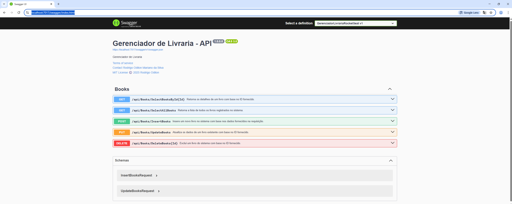

# 💻 Desafio Rocketseat - Gestão de Livraria  (API Web do ASP.NET Core)

📚 Desafio Prático – Gestão de Livraria
Este repositório contém a implementação do desafio prático proposto pela Rocketseat, cujo objetivo é desenvolver uma API para gerenciamento de uma livraria online. O sistema permite que usuários criem, visualizem, editem e excluam livros.

🚀 Tecnologias Utilizadas
.NET 6 / ASP.NET Core

C#

Swagger (Swashbuckle)

Rate Limiting (ASP.NET Core Rate Limiter)

Validação com Data Annotations

Armazenamento em memória com DataTable

OpenAPI

📌 Requisitos do Desafio
Criar um livro

Visualizar todos os livros

Editar informações de um livro

Excluir um livro

📖 Campos do Livro
id (identificador único)

title (título)

author (autor)

gender (gênero – ex: ficção, romance, mistério)

price (preço)

quantity (quantidade em estoque)

🛠️ Como Executar
Clone o repositório:

git clone https://github.com/seu-usuario/seu-repositorio.git

Navegue até o diretório do projeto:

cd GerenciadorLivrariaRocketSeat

Abra o projeto no Visual Studio

Execute o projeto: Pressione F5 ou clique em "Iniciar Depuração"

## 📸 Demonstração

## 👨‍💻 Autor

Desenvolvido por [Rodrigo Odilon](https://github.com/rodrigoodilon)

